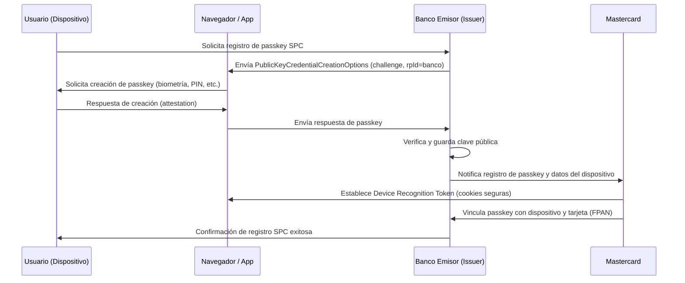
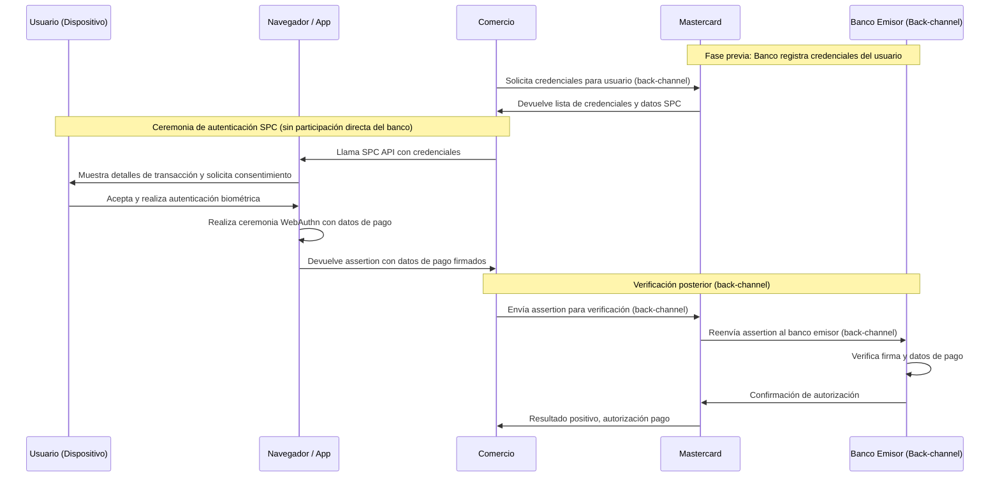

# Mejoras Para Implementar las POCs de Passkey / SPC con MasterCard y Visa

## Introducción

Secure Payment Confirmation (SPC) es una especificación W3C que extiende WebAuthn para casos de uso de pagos. SPC permite autenticación fuerte durante flujos de pago con funcionalidades adicionales específicas para el contexto de pagos.

**Documentación de referencia:**
- [W3C Secure Payment Confirmation Specification](https://www.w3.org/TR/secure-payment-confirmation/)
- [WebAuthn Level 3 Specification](https://www.w3.org/TR/webauthn-3/)

## Rol del Banco Emisor en el Flujo SPC con Mastercard

La implementación de SPC con un partner como Mastercard redefine la participación del banco emisor en la autenticación de pagos, priorizando una experiencia de usuario fluida sin sacrificar la seguridad. Los puntos clave de este modelo son:

- **Propiedad de la Credencial:** El banco emisor es el propietario de la `passkey` (credencial FIDO2), la cual está vinculada al usuario y su dispositivo tras un proceso de verificación de identidad (ID&V).
- **Delegación de la Autenticación Front-End:** El banco delega la orquestación de la ceremonia WebAuthn al comercio y a la red de pagos (Mastercard). Esto significa que la interacción `payment.get()` ocurre directamente en el navegador del usuario sin necesidad de una redirección al dominio del banco.
- **Control en el Backend:** A pesar de la delegación, el banco mantiene el control total en el backend. Es el responsable último de:
    - Gestionar el ciclo de vida de las `passkeys`.
    - Recibir el resultado de la autenticación verificado por Mastercard.
    - Realizar la validación final y tomar la decisión de autorizar o denegar el pago.
- **Mejora de la Experiencia de Usuario (UX):** Al evitar redirecciones, se reduce la fricción en el proceso de pago, lo que resulta en una experiencia más rápida y transparente para el cliente.

En resumen, aunque el banco no participa de forma visible en el front-end durante la autenticación, su rol como ancla de confianza, gestor de la credencial y autoridad final de la transacción es indispensable para la seguridad e integridad del ecosistema SPC.

## Fundamentos Cross-Origin en SPC

A continuación tienes una visión completa (y con ejemplos prácticos) de qué significa el campo crossOrigin en WebAuthn y en Secure Payment Confirmation (SPC), cómo lo calcula el navegador, por qué existe y qué debe hacer tu servidor cuando lo recibe.

**Resumen en una frase:**

crossOrigin es un indicador de riesgo: vale true cuando la llamada a navigator.credentials.create()/get() se hace desde un documento que NO es "same-origin" con la página superior; los navegadores lo añaden automáticamente al clientDataJSON, y los Relying Parties (RPs) lo usan para decidir si aceptar o rechazar la autenticación. En SPC, esta capacidad se amplía para que un tercero (por ejemplo, un comercio) pueda iniciar la autenticación de la passkey del banco, siempre que el RP verifique crossOrigin, topOrigin y otros campos de pago.

### 2.1 CrossOrigin en WebAuthn "puro"

#### 2.1.1 Dónde aparece

Cuando el navegador genera clientDataJSON, incluye cuatro campos fijos —type, challenge, origin y crossOrigin— y los escribe siempre en ese orden.

#### 2.1.2 Cómo se calcula

El valor se deriva del parámetro interno sameOriginWithAncestors:
- false → crossOrigin = false (llamada desde la propia página o un iframe del mismo origen).
- true → crossOrigin = true (llamada desde un iframe o ventana cuyo origen difiere del "top-level").

En la práctica, si tu widget de inicio de sesión está embebido en un iframe en el dominio del partner, el navegador marcará crossOrigin=true aunque el RP siga siendo tu dominio.

#### 2.1.3 Qué debe hacer el servidor
- Recupera y decodifica clientDataJSON.
- Comprueba que crossOrigin coincide con lo que esperabas para esa petición (por ejemplo, tu flujo permite iframes, o sólo aceptas same-origin). El algoritmo de verificación limitado del estándar incluye expresamente ese check.
- Si tu RP no admite autenticaciones en terceros dominios, rechaza el intento cuando crossOrigin=true.

Los desarrolladores lo ven clarísimo: en la estructura JS resultante, crossOrigin es un boolean que aparece junto al origin.
Por defecto es false; el propio GitHub del grupo explica que únicamente se añade (y vale true) en contextos realmente cross-origin.

### 2.2 Por qué existe (modelo de amenazas)

El campo protege contra ataques donde un sitio malicioso intenta reaprovechar la respuesta WebAuthn para suplantar al usuario en el dominio legítimo. Un RP puede:
1. Permitir sólo mismas-origin.
2. Permitir iframes de partners concretos, validando que origin y crossOrigin concuerdan con lo pactado.

Así corta intentos de "credential forwarding" si el atacante embebe tu login en un dominio diferente.

### 2.3 CrossOrigin dentro de Secure Payment Confirmation

#### 2.3.1 SPC habilita la autenticación por terceros

Una de las grandes diferencias de SPC es permitir que un comercio (o su PSP) invoque la passkey del banco sin redirigir al usuario. Esto se documenta como la "ceremonia de autenticación cross-origin".

#### 2.3.2 Campos extra que complementan crossOrigin

Para que el RP (el banco o la red de tarjetas) pueda verificar con seguridad:
- Se mantiene crossOrigin.
- Se añaden payment.topOrigin, payment.rpId, payment.payeeOrigin, etc.
- Además, el type cambia a "payment.get" —otra pista inequívoca de que la assertion viene de SPC y no de un login normal.

#### 2.3.3 Cómo se valida en SPC

El RP debe seguir los pasos de WebAuthn y además:
1. Confirmar type === "payment.get".
2. Asegurar que crossOrigin concuerda con el dominio que esperaba (por ejemplo, que la llamada vino realmente de merchant.com).
3. Verificar los campos de la extensión payment (importe, nombre del comercio, rpId, topOrigin…).

MDN resume el patrón: gracias a la permission policy "payment", un iframe cross-origin puede crear o usar la credencial; pero el RP debe validar todo lo anterior para evitar abusos.

### 2.4 Ejemplo de flujo cross-origin (SPC)

```
merchant.com (top) ─┐
                    │  ← iframe allow="payment"
   └─►   bank.com   ┘  (scripts del PSP)
```

1. bank.com pide PaymentRequest con method "secure-payment-confirmation"
2. Navegador muestra el diálogo SPC.
3. Usuario confirma con biometría → se genera `payment.get`, crossOrigin=true, topOrigin="https://merchant.com"
4. merchant.com recibe la assertion y la envía al banco / red
5. El RP valida firma, challenge, crossOrigin, topOrigin, etc. → SCA superada

Cada paso 3–5 se sustenta en los campos mencionados y en el chequeo de crossOrigin. Esta capacidad "invocar la passkey del banco sin salir del checkout" es lo que hace SPC atractivo para reducir fricción.

## Limitaciones Actuales de Ping 7.5.1

### 1. Soporte para el tipo "payment.get" en ClientDataJSON `[COMPLETADO]`

**Descripción:** Se ha modificado la clase `AuthenticationFlow.java` para que, durante la validación de la aserción WebAuthn, se acepten tanto el tipo `"webauthn.get"` (estándar) como `"payment.get"` (requerido por SPC). Esto hace que la implementación sea compatible con las especificaciones de Secure Payment Confirmation.

### 2. Validaciones Adicionales Requeridas por SPC

**Según el estándar W3C, SPC requiere validaciones adicionales:**

#### 2.1 Validación de Información de Pago
- **Payment Instrument:** Validar datos del instrumento de pago (displayName, details, icon)
- **Payee Information:** Validar información del comerciante (payeeName, payeeOrigin)
- **Payment Amount:** Validar monto y moneda de la transacción

#### 2.2 Análisis de Validación de Origin Actual vs Requisitos SPC

**Estado Actual:** La validación de origen existente es estricta y está diseñada para flujos `same-origin`, lo que representa una limitación para los flujos `cross-origin` de SPC, que requieren la validación de campos adicionales como `topOrigin` y `payeeOrigin`.

**Trabajo Futuro (Fase 2):** Se deberá ampliar esta lógica para soportar completamente las validaciones de origen cruzado que exige el estándar SPC.

#### 2.3 Browser-Bound Keys
- **Propósito:** Proporcionar evidencia criptográfica de posesión del dispositivo
- **Requisito:** Claves auxiliares que residen únicamente en un dispositivo específico
- **Implementación:** Crear y gestionar pares de claves adicionales para evidencia de dispositivo

### 3. Modificaciones Realizadas y Trabajo Futuro

#### 3.1 Soporte para Contexto SPC en Nodos `[COMPLETADO]`

Se han realizado las siguientes modificaciones en los nodos de Java para dar soporte a los flujos de la PoC:

- **`WebAuthnRegistrationNode.java`:** Se añadió una opción de configuración (`enablePaymentExtension`) que, al activarse, inyecta la extensión `payment` en el script de registro del cliente. Esto permite la creación de credenciales `passkey` compatibles con SPC.
- **`WebAuthnAuthenticationNode.java`:** Se modificó el nodo para que, tras una autenticación exitosa, exporte los datos de la aserción (`clientDataJSON`, `authenticatorData`, `signature`, `credentialId`) al `transientState`. Esto permite que un nodo de script posterior pueda consumir estos datos para construir la redirección en el flujo NO-SPC.

### 4. Consideraciones de Seguridad

#### 4.1 Validaciones Cross-Origin
- Implementar lista blanca de orígenes permitidos
- Validar `payeeOrigin` contra orígenes registrados
- Verificar integridad de datos en comunicación cross-origin
- **No ignorar crossOrigin:** Es tan importante como challenge u origin
- **Registrar orígenes autorizados:** Validar que origin (WebAuthn) o topOrigin (SPC) coincide

#### 4.2 Protección contra Ataques
- **Relay Attacks:** Validar contexto temporal del pago
- **Phishing:** Verificar información visual del instrumento de pago
- **Man-in-the-Middle:** Asegurar integridad de datos de pago
- **Credential Forwarding:** Usar políticas de permisos adecuadas (publickey-credential-create, payment)

#### 4.3 Privacidad del Usuario
- Minimizar exposición de datos del instrumento de pago
- Implementar consentimiento explícito para uso cross-origin
- Auditoría de transacciones de pago

#### 4.4 Buenas Prácticas de Implementación
1. **Separar credenciales:** Distinguir entre credenciales de pago y login para evitar reutilización
2. **Validación completa:** Verificar todos los campos SPC (type, crossOrigin, topOrigin, payment fields)
3. **Políticas de seguridad:** Usar permission policies apropiadas para limitar acceso de iframes
4. **Monitoreo:** Vigilar cambios en navegadores (ej: Chrome 137 cambió excepciones de SecurityError a NotAllowedError)
5. **Pruebas cross-browser:** Validar compatibilidad en Chrome >= 95 y Edge

### 5. Integración con Payment Request API

SPC se integra con Payment Request API para proporcionar una experiencia de usuario completa:

```javascript
const request = new PaymentRequest([{
    supportedMethods: "secure-payment-confirmation",
    data: {
        credentialIds: [/* credential IDs */],
        challenge: new Uint8Array(/* challenge */),
        rpId: "bank.example",
        instrument: {
            displayName: "Visa ****1234",
            details: "****1234 | 01/29",
            icon: "https://bank.example/card-art.png"
        },
        payeeName: "Merchant Shop",
        payeeOrigin: "https://merchant.example"
    }
}], {
    total: {
        label: "Total",
        amount: { currency: "USD", value: "5.00" }
    }
});
```

## Plan de Implementación

### Fase 1: Soporte Básico SPC
1. Modificar `AuthenticationFlow.accept()` para soportar "payment.get"
2. Añadir configuración SPC en `WebAuthnAuthenticationNode`
3. Implementar validaciones básicas de información de pago

### Fase 2: Funcionalidades Avanzadas
1. Implementar soporte para browser-bound keys
2. Desarrollar página pivot para comunicación cross-origin
3. Añadir validaciones de seguridad específicas de SPC

### Fase 3: Integración Completa
1. Integrar con Payment Request API
2. Implementar auditoría y logging específico de SPC
3. Pruebas de integración con MasterCard y Visa

## Archivos a Modificar

1. **`AuthenticationFlow.java`:** Validación de tipo de cliente
2. **`WebAuthnAuthenticationNode.java`:** Configuración y contexto SPC
3. **Scripts de cliente:** Soporte para Payment Request API
4. **Recursos web:** Página pivot para comunicación cross-origin
5. **Configuración:** Nuevos parámetros de configuración SPC

## Flujos de Trabajo

### Flujo de Registro SPC



#### Puntos Clave del Flujo de Registro:

1. **Inicio del Registro**: El usuario solicita registrar un passkey SPC en el banco emisor
2. **Creación de Passkey**: El banco envía las opciones de creación con su rpId
3. **Autenticación Biométrica**: El navegador solicita al usuario autenticarse (biometría, PIN)
4. **Attestation**: El navegador genera y envía la respuesta de attestation al banco
5. **Verificación**: El banco verifica la attestation y almacena la clave pública
6. **Notificación a MasterCard**: El banco notifica a MasterCard sobre el nuevo passkey
7. **Device Recognition**: MasterCard establece tokens de reconocimiento del dispositivo
8. **Vinculación**: MasterCard vincula el passkey con el dispositivo y la tarjeta (FPAN)
9. **Confirmación**: El banco confirma al usuario el registro exitoso

#### Integración con WebAuthnRegistrationNode:

En el contexto de ForgeRock AM, el paso de "Notifica registro de passkey y datos del dispositivo" a MasterCard ocurriría después de que el `WebAuthnRegistrationNode` complete exitosamente el registro. Esto requeriría:

1. **Capturar los datos de registro** en el `transientState`
2. **Invocar el endpoint de MasterCard** desde un nodo posterior
3. **Procesar la respuesta** incluyendo el `dasAuthenticatorInstanceId`
4. **Almacenar la vinculación** entre el passkey y los datos de MasterCard

### 6.9 Diagrama de Secuencia - Flujo de Autenticación SPC

Este diagrama ilustra el flujo de autenticación cuando el usuario realiza un pago en un comercio. Aunque el banco emisor no es visible directamente para el usuario durante el checkout, juega un papel crucial en la validación de la autenticación.



#### Puntos Clave del Flujo de Autenticación SPC:

1. **Provisión de Credenciales**: El comercio obtiene las credenciales del usuario desde Mastercard via back-channel.
2. **Ceremonia SPC**: El comercio llama la SPC API directamente en el navegador, sin participación directa del banco.
3. **Autenticación Local**: El navegador muestra detalles de la transacción y el usuario se autentica localmente.
4. **Firma con Datos de Pago**: La ceremonia WebAuthn incluye datos de pago en la assertion firmada.
5. **Verificación Back-Channel**: El comercio envía la assertion al banco a través de Mastercard para verificación.
6. **Validación Final**: El banco verifica la firma y los datos de pago, y decide sobre la autorización.

#### Integración con WebAuthnAuthenticationNode:

**IMPORTANTE**: En el flujo SPC verdadero, el `WebAuthnAuthenticationNode` **NO participa directamente** en la ceremonia de autenticación. El banco solo recibe assertions vía back-channel para verificación posterior.

En el contexto de ForgeRock AM, el banco (Account Provider) actúa como:

1. **Proveedor de Credenciales** (durante el registro inicial)
2. **Verificador de Assertions** (vía back-channel después de la ceremonia SPC)
3. **Autoridad de Pago** (toma la decisión final de autorizar/rechazar)

**Nota**: Lo que hemos implementado hasta ahora es un **flujo NO-SPC** donde el banco sí participa directamente en la autenticación, similar al flujo tradicional WebAuthn pero con capacidad para exportar datos de assertion.

## Resumen de Cambios Requeridos por Flujo

A continuación se detallan las modificaciones necesarias para cada uno de los flujos de Passkey solicitados.

### Flujo NO-SPC (Integración con MasterCard)

Este flujo utiliza el estándar WebAuthn sin las extensiones de pago. La plataforma de PingAM es compatible en gran medida, pero requiere ajustes para la integración final.

#### 1. Registro de Passkey
- **Estado Actual**: El flujo de registro de `WebAuthnRegistrationNode` es funcional para crear credenciales Passkey estándar (no-SPC).
- **Acción Requerida**: Ninguna en el proceso de registro en sí. Las credenciales generadas son válidas.

#### 2. Autenticación de Passkey
- **Estado Actual**: El `WebAuthnAuthenticationNode` puede validar las credenciales correctamente.
- **Acción Requerida**: Es necesario **exportar los datos de la aserción** de la autenticación al `transientState` de ForgeRock. Un nodo posterior (por ejemplo, un `Scripted Decision Node`) debe recoger estos datos para construir la redirección final hacia MasterCard o el comercio, incluyendo parámetros como `clientDataJSON`, `authenticatorData`, `signature` y `credentialId`.

### Flujo SPC (Secure Payment Confirmation)

Este flujo requiere habilitar las extensiones de pago de WebAuthn para cumplir con los requisitos de SPC.

#### 1. Registro de Passkey (SPC)
- **Estado Actual**: No soportado. El script de cliente no solicita la extensión `payment`.
- **Acción Requerida**: 
    1. **Modificar `webauthn-client-registration-script.js`**: Se ha añadido el placeholder `{spcExtensions}` a la llamada `navigator.credentials.create()`. 
    2. **Actualizar `WebAuthnRegistrationNode.java`**: El nodo debe ser modificado para que, cuando se requiera un registro SPC, inserte `extensions: { payment: { isPayment: true } }` en el placeholder `{spcExtensions}`.

#### 2. Autenticación de Passkey (SPC)
- **Integración con MasterCard**: 
    - **Estado Actual**: No se requieren cambios, ya que la autenticación se delega completamente a MasterCard. El banco solo recibe el resultado de la validación.
- **Soporte Genérico en la Plataforma**: 
    - **Estado Actual**: No soportado.
    - **Acción Requerida**: Para que la plataforma soporte autenticaciones SPC de forma nativa (sin delegar), es necesario:
        1. **Modificar `WebAuthnAuthenticationNode.java`**: Añadir lógica para procesar y validar los campos `topOrigin` y `parentOrigin` que vienen en el `clientDataJSON`.
        2. **Soportar `payment.get`**: Asegurar que el servidor pueda manejar `"type": "payment.get"` en el `clientDataJSON`, además del estándar `webauthn.get`.

## Plan de Implementación por Fases (Revisado)

Tras analizar los requisitos de la integración con MasterCard, se redefine el plan para priorizar la validación del flujo SPC desde la fase inicial.

### Fase 1: PoC (Proof of Concept) - Flujo SPC Mínimo Viable

El objetivo es demostrar la capacidad de crear una passkey compatible con SPC y, al mismo tiempo, asegurar un flujo funcional de extremo a extremo para la PoC.

**Alcance:**
1.  **Registro de Passkey SPC (Prioridad Máxima):** `[COMPLETADO]`
    -   Se ha modificado `WebAuthnRegistrationNode.java` para que sea capaz de **insertar la extensión `payment`** en el script de cliente (`{spcExtensions}`). Esto permite crear una credencial que puede ser utilizada en el flujo SPC de MasterCard.
2.  **Autenticación NO-SPC (Tarea de Soporte):** `[COMPLETADO]`
    -   Se ha modificado `WebAuthnAuthenticationNode.java` para **exportar los datos de la aserción** (`clientDataJSON`, `authenticatorData`, `signature`, `credentialId`) al `transientState`.
3.  **Script de Redirección (Siguiente Paso):** `[PENDIENTE]`
    -   Implementar un **nodo de script** que consuma los datos del `transientState` y construya la URL de redirección final hacia el partner (Mastercard) para completar el flujo de autenticación NO-SPC.

Este enfoque permite mitigar riesgos, validando la pieza más importante (registro SPC) de forma temprana.

### Fase 2: Producción - Soporte SPC Genérico y Completo

El objetivo es evolucionar la plataforma para que ofrezca un soporte nativo y robusto para SPC, independiente de un único partner.

**Alcance:**
1.  **Autenticación SPC Genérica:**
    -   Mejorar `WebAuthnAuthenticationNode.java` para que pueda procesar y validar de forma nativa una aserción de SPC. Esto incluye:
        -   Validar `topOrigin` y `parentOrigin` para flujos cross-origin.
        -   Soportar el tipo `payment.get` en el `clientDataJSON`.

Este plan revisado alinea mejor el esfuerzo de la PoC con los objetivos estratégicos a largo plazo.